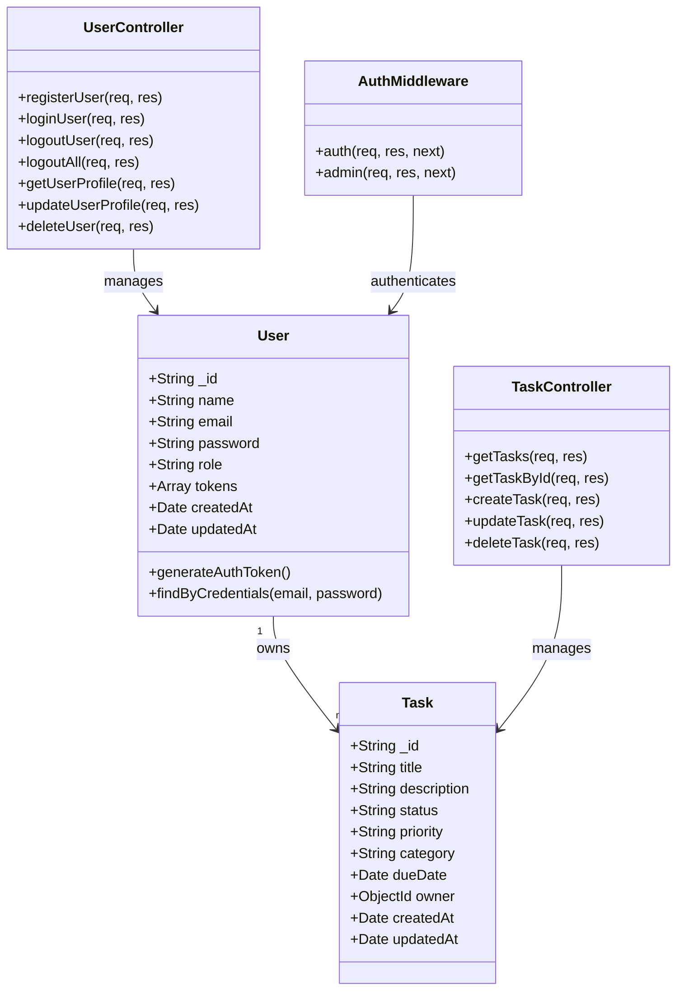

# Class Diagram

Below is a UML class diagram representing the core domain models of the Task Manager application.

## Entity Relationships

1. **User-Task Relationship**:
   - A User can have many Tasks (one-to-many)
   - Each Task belongs to exactly one User

2. **User-Token Relationship**:
   - A User can have multiple authentication tokens
   - Tokens are embedded in the User document

## Key Models

### User Model
The User model represents application users with authentication information.

**Fields**:
- `_id`: MongoDB ObjectID
- `name`: User's full name
- `email`: User's email address (unique)
- `password`: Hashed password
- `role`: User role (user/admin)
- `tokens`: Array of JWT tokens
- `createdAt`: Timestamp of creation
- `updatedAt`: Timestamp of last update

**Methods**:
- `generateAuthToken()`: Generates a JWT token for authentication
- `findByCredentials(email, password)`: Static method to find user by login credentials

### Task Model
The Task model represents tasks that belong to users.

**Fields**:
- `_id`: MongoDB ObjectID
- `title`: Task title
- `description`: Detailed description of the task
- `status`: Current status (todo, in_progress, completed)
- `priority`: Task priority (low, medium, high)
- `category`: Task category/label
- `dueDate`: Optional due date
- `owner`: Reference to the User who owns the task
- `createdAt`: Timestamp of creation
- `updatedAt`: Timestamp of last update

## Controllers

### UserController
Handles user-related operations and authentication.

**Methods**:
- `registerUser`: Creates a new user account
- `loginUser`: Authenticates a user and provides a token
- `logoutUser`: Logs out from current device
- `logoutAll`: Logs out from all devices
- `getUserProfile`: Retrieves the user profile
- `updateUserProfile`: Updates user information
- `deleteUser`: Deletes a user account

### TaskController
Manages CRUD operations for tasks.

**Methods**:
- `getTasks`: Retrieves all tasks for the authenticated user
- `getTaskById`: Retrieves a specific task by ID
- `createTask`: Creates a new task
- `updateTask`: Updates an existing task
- `deleteTask`: Deletes a task

## Middleware

### AuthMiddleware
Provides authentication and authorization functionality.

**Methods**:
- `auth`: Verifies a user's JWT token
- `admin`: Ensures a user has admin privileges 