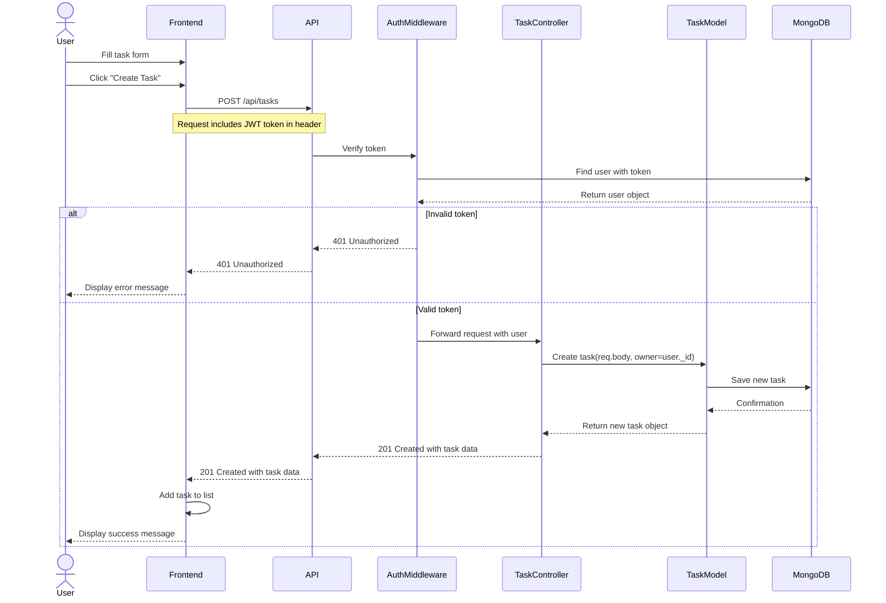
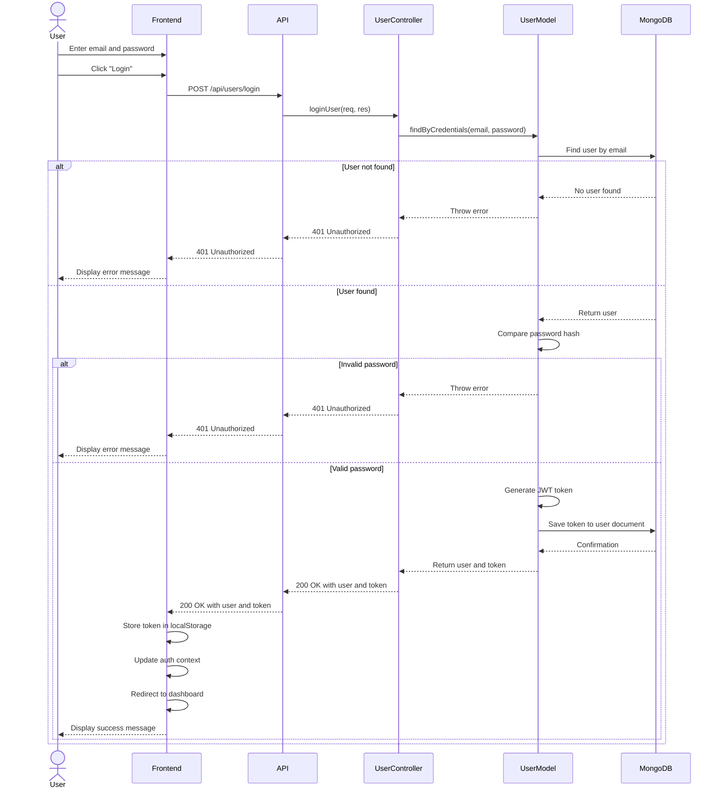
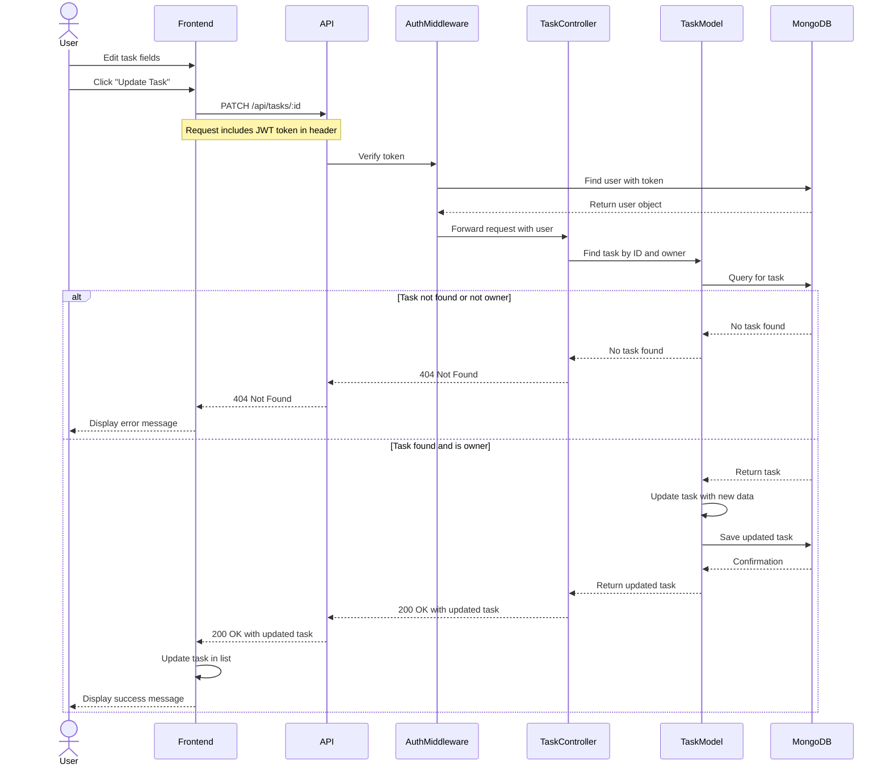

# Sequence Diagrams

This document contains sequence diagrams that illustrate the flow of key operations in the Task Manager application.

## Task Creation Flow

The following sequence diagram shows the process of creating a new task:

## User Authentication Flow

The following sequence diagram shows the user login process:

## Task Update Flow

The following sequence diagram shows the process of updating a task:

These diagrams help to visualize the interaction between different components of the application and the flow of data during key operations. 